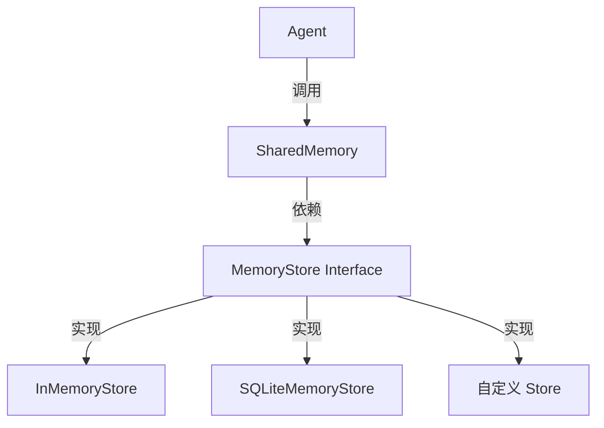
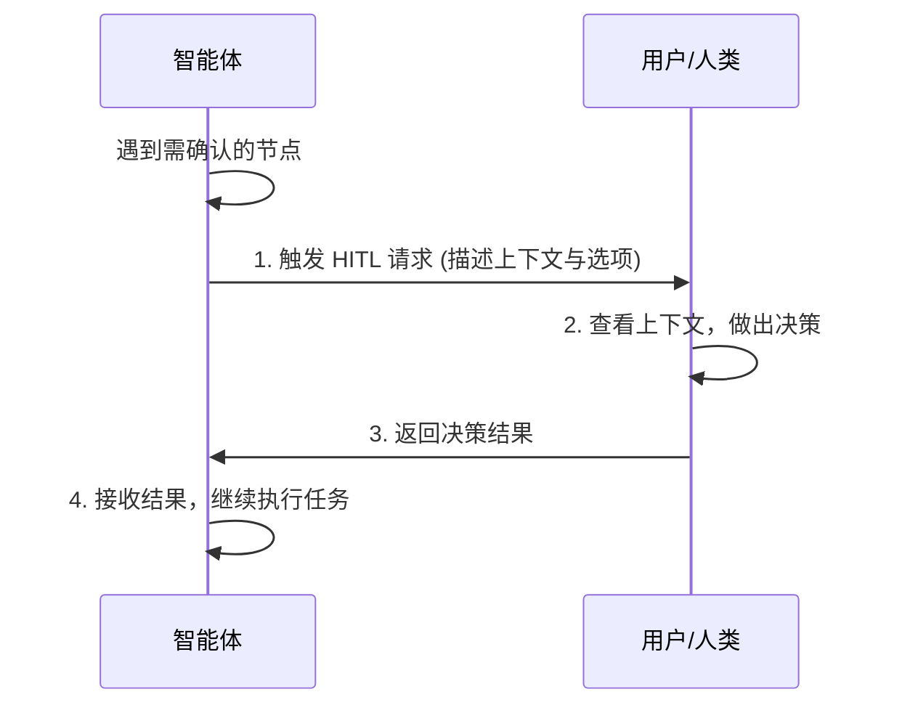

# Open-Multi-Agent 深入探索：SharedMemory 与 Human-in-the-loop

本文档基于 [open-multi-agent](https://github.com/open-multi-agent/open-multi-agent) 源码分析，重点探索其**共享内存机制（SharedMemory）**和**人在回路设计（Human-in-the-loop）**。

---

## 一、SharedMemory 机制分析

### 1. 架构设计

SharedMemory 采用了**存储层与接口层分离**的设计模式：

- **`MemoryStore` 接口**：定义了所有存储实现必须遵循的契约（`add`、`search`、`delete`、`clear`）。
- **`SharedMemory` 类**：作为门面（Facade），封装了具体的存储实现，为 Agent 提供统一的内存操作接口。
- **持久化策略**：
    - `InMemoryStore`：默认实现，适合轻量级测试。
    - `SQLiteMemoryStore`：生产级实现，支持通过 ORM 进行数据持久化。

### 2. 核心功能

- **跨会话共享**：多个 Agent 可以访问同一内存上下文，实现复杂的信息传递。
- **语义搜索**：`search` 方法支持基于向量相似度的语义检索（通常配合 Embedding 使用）。
- **上下文管理**：支持通过 `delete` 和 `clear` 清理过期或无用的上下文信息。

---

## 二、Human-in-the-loop (HITL) 设计

HITL 机制允许 Agent 在执行关键决策或遇到不确定性时，主动将控制权交给人类用户。

### 1. 工作流机制

### 2. 核心实现

- **`DelegateTool` 工具**：
    这是一个特殊的内置工具，Agent 被训练/提示在需要人类介入时调用此工具。
    - **触发条件**：权限限制、风险操作（如删除数据库）、信息确认（如发送邮件）。
    - **参数设计**：通常包含 `question`（提问内容）、`options`（可选项）和 `context`（相关上下文）。

- **暂停与恢复**：
    当 Agent 调用 `DelegateTool` 时，编排引擎（Orchestrator）会捕获该请求，**暂停**当前 Agent 的执行流，并将请求通过 WebSocket/HTTP 推送给前端。收到人类响应后，引擎将结果注入 Agent 的 `ToolResult`，**恢复**执行。

### 3. 应用场景

- **关键操作确认**：例如 "确认是否要清空数据库？"
- **模糊意图澄清**：当用户指令不明确时，Agent 询问 "您是指 2023 年的报告还是 2024 年的？"
- **兜底处理**：当 Agent 多次尝试仍无法解决问题时，转交人工接管。

---

## 三、总结

Open-Multi-Agent 通过标准化的 `MemoryStore` 接口实现了灵活的共享记忆系统，解决了多智能体协作中的信息孤岛问题；通过 `DelegateTool` 和编排引擎的配合，实现了安全可控的人机协作流程，极大提升了系统的实用性和安全性。
